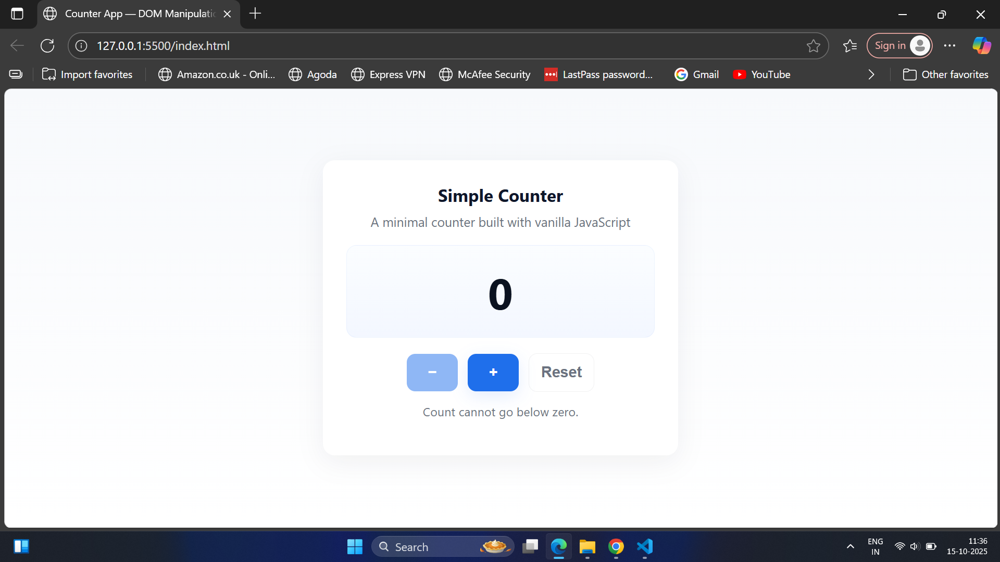
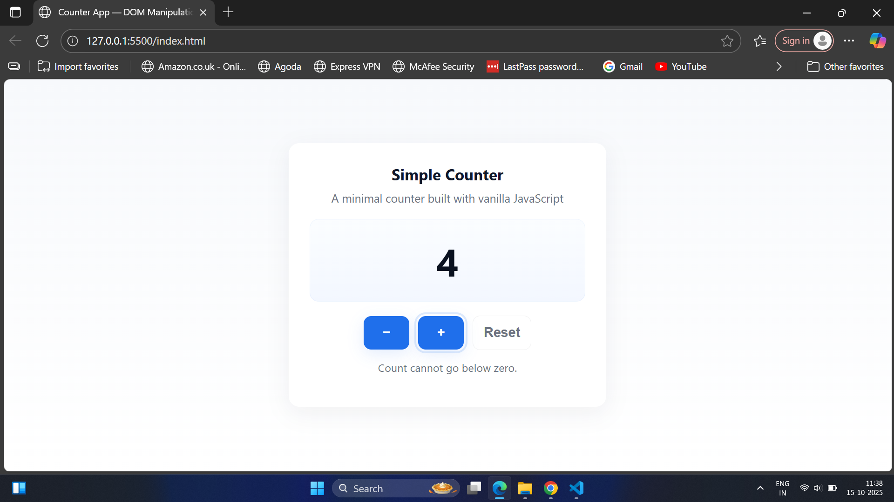
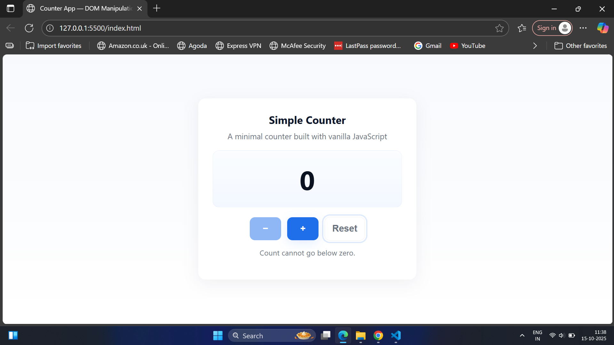

# Task 3 – Counter App

## Overview
This is a simple **Counter Application** built using **HTML, CSS, and Vanilla JavaScript** as part of the Codveda Front-End Internship tasks.

The app demonstrates **basic DOM manipulation**, **event handling**, and **state management** in JavaScript.

## Features
- Increment, Decrement, and Reset buttons
- Prevents the counter from going below zero
- Real-time updates using JavaScript DOM manipulation
- Minimal, responsive, and clean design
- Keyboard support (ArrowUp / ArrowDown / R for reset)
- Accessible (ARIA labels and focus outlines)

## Technologies Used
- HTML5
- CSS3
- JavaScript (ES6)

## How to Run
1. Download or clone this folder: `CounterApp`
2. Open the file `index.html` in any modern browser (Chrome, Edge, Firefox).
3. Interact with the counter using mouse clicks or keyboard keys.

## Author
**Poojitha Velamala**

## Screenshots

### Desktop View
This screenshot shows the **Counter App interface** on a desktop. It includes three options: **Increment**, **Decrement**, and **Reset**.

### Increment Function
This screenshot demonstrates the **Increment button** functionality, increasing the counter value by 1.

### Decrement Function
This screenshot shows the **Decrement button** functionality. The counter value decreases by 1 but will not go below zero.

### Reset Function
This screenshot highlights the **Reset button**, which resets the counter value back to 0.

